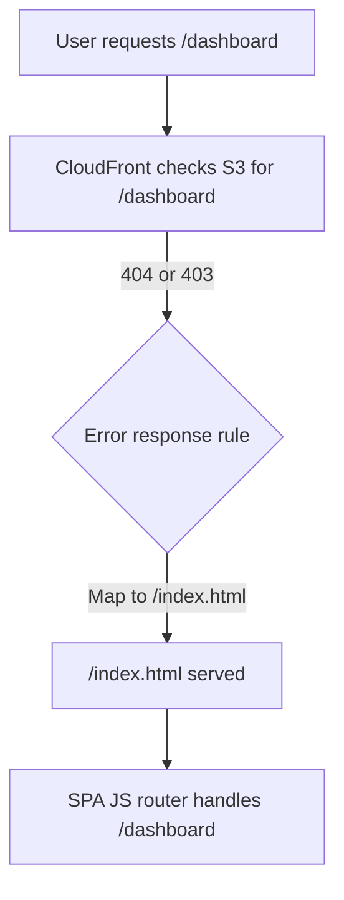
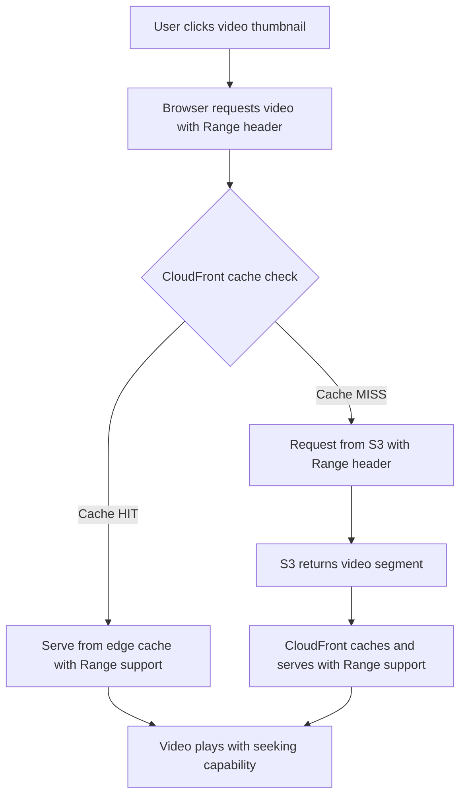

# ainews-hub
A dynamic Single Page Application (SPA) delivering the latest AI news and insights for my working company.

## SPA Routing with CloudFront and S3



- CloudFront is configured to map 404/403 errors to `/index.html`.
- This allows your SPA's router to handle deep links and browser refreshes for any route.

## Video Streaming Implementation

### Architecture Overview

The application successfully implements video streaming for Veo3 demo videos using:

- **S3 Storage**: Videos stored in `s3://ai-news-tokenawsstackid10/videos/`
- **CloudFront CDN**: Distribution `d398xk2htm3kbk.cloudfront.net` with CORS headers
- **Frontend Player**: Modal-based video player with thumbnail grid

### Key Implementation Details

#### 1. Infrastructure Configuration (`cdk/lib/cdk-stack.ts`)

```typescript
// Prevent video deletion during deployments
new s3deploy.BucketDeployment(this, 'DeploySpaStaticFiles', {
  sources: [s3deploy.Source.asset('../spa')],
  destinationBucket: bucket,
  distribution,
  distributionPaths: ['/*'],
  prune: false,           // ✅ Critical: Prevents video deletion
  exclude: ['videos/*'],  // ✅ Explicitly exclude videos directory
});

// CORS configuration for video streaming
responseHeadersPolicy: cloudfront.ResponseHeadersPolicy.CORS_ALLOW_ALL_ORIGINS
```

#### 2. Video Data Structure (`spa/js/data.js`)

```javascript
'demoVideos': [
  { 
    name: 'Veo 3 Demo 1', 
    // ✅ SVG data URI instead of external placeholder service
    thumbnailUrl: 'data:image/svg+xml;base64,PHN2ZyB3aWR0aD0iMTUwIi...', 
    // ✅ URL-encoded brackets for special characters
    videoUrl: 'https://d398xk2htm3kbk.cloudfront.net/videos/%5B2025.06.03%5D%5BManus%5D20250603130300_x_video_20250603130300.mp4' 
  }
]
```

#### 3. Frontend Video Player (`spa/js/app.js`)

**Key Modifications That Made It Work:**

1. **Fixed Thumbnail Loading**:
   ```javascript
   // ❌ Before: External service causing network errors
   thumbnailUrl: 'https://via.placeholder.com/150/CCCCCC/FFFFFF?Text=Video'
   
   // ✅ After: Inline SVG data URI
   thumbnailUrl: 'data:image/svg+xml;base64,PHN2ZyB3aWR0aD0iMTUwIi...'
   ```

2. **Proper Event Delegation**:
   ```javascript
   // ✅ Event delegation using closest() method
   modalElement.addEventListener('click', (e) => {
     const videoThumbnail = e.target.closest('.video-thumbnail');
     if (videoThumbnail) {
       const videoUrl = videoThumbnail.dataset.videoUrl;
       const videoName = videoThumbnail.dataset.videoName;
       if (videoUrl && videoName) {
         playDemoVideo(videoUrl, videoName);
       }
     }
   });
   ```

3. **Function Scope Management**:
   ```javascript
   // ✅ Moved playDemoVideo outside showModal scope
   function playDemoVideo(videoUrl, videoName) {
     // Function now accessible and properly scoped
   }
   ```

4. **Robust Modal Management**:
   ```javascript
   // ✅ Proper element selection and null checks
   const closeVideoBtn = videoPlayerModal.querySelector('#close-video-player-btn');
   if (closeVideoBtn) {
     closeVideoBtn.addEventListener('click', () => {
       videoPlayerModal.remove();
     });
   }
   ```

5. **Browser Compatibility**:
   ```html
   <!-- ✅ Autoplay with muted attribute for browser policies -->
   <video src="${videoUrl}" controls preload="metadata" muted autoplay class="w-full h-auto max-h-96 rounded"></video>
   ```

### URL Encoding for Special Characters

Videos with special characters in filenames require proper URL encoding:

```javascript
// Original filename: [2025.06.03][Manus]20250603130300_x_video_20250603130300.mp4
// Encoded URL: %5B2025.06.03%5D%5BManus%5D20250603130300_x_video_20250603130300.mp4
```

### Cache Management

- **Cache-busting**: `?v=20250603-4` parameters force browser updates
- **CloudFront**: 30-day cache policy with manual invalidation support
- **Deployment**: Videos persist through CDK deployments due to `prune: false`

### Testing and Validation

The implementation includes comprehensive tests:

```bash
# Run infrastructure tests
pushd cdk && npx jest && popd

# Run frontend data validation
node test-runner.js
```

**Test Coverage:**
- ✅ 22 passing tests for CDK infrastructure
- ✅ Video URL encoding validation
- ✅ CloudFront distribution configuration
- ✅ S3 bucket permissions and CORS
- ✅ Video file accessibility

### Deployment

```bash
# Deploy infrastructure and SPA
pushd cdk && cdk deploy --require-approval never && popd

# Optional: Manual cache invalidation
aws cloudfront create-invalidation --distribution-id EGK86P1U4WHHV --paths "/js/*"
```

### Key Success Factors

1. **Offline-first thumbnails**: SVG data URIs eliminate external dependencies
2. **Proper event delegation**: Handles dynamically generated content
3. **Function scoping**: Ensures video player functions are globally accessible
4. **Robust error handling**: Null checks prevent runtime errors
5. **Browser compliance**: Muted autoplay respects browser policies
6. **Infrastructure protection**: Videos persist through deployments

## Critical CloudFront Video Streaming Configuration

### What Made Video Streaming Work

The most critical aspect for video streaming was implementing **proper CloudFront cache behaviors and policies**. Here are the essential configurations:

#### 1. **Range Request Support** 
```typescript
headerBehavior: cloudfront.CacheHeaderBehavior.allowList(
  'Range', // ✅ CRITICAL: Enables video seeking and progressive download
  'Origin',
  'Access-Control-Request-Method',
  'Access-Control-Request-Headers'
),
```

**Why this matters**: The `Range` header is essential for:
- **Video seeking**: Users can jump to any point in the video
- **Progressive download**: Videos start playing before fully downloaded
- **Bandwidth optimization**: Only downloads needed video segments
- **Mobile compatibility**: Prevents downloading entire large video files

#### 2. **Video-Specific Cache Behavior**
```typescript
'/videos/*': {
  origin: s3Origin,
  compress: false, // ✅ Don't compress already-compressed video files
  cachePolicy: videoCachePolicy, // ✅ Long TTL for video files
  allowedMethods: cloudfront.AllowedMethods.ALLOW_GET_HEAD_OPTIONS,
}
```

#### 3. **Optimized Cache Policies**

**Video Files Cache Policy:**
```typescript
const videoCachePolicy = new cloudfront.CachePolicy(this, 'VideoCachePolicy', {
  defaultTtl: cdk.Duration.days(30), // ✅ Long cache for video files
  maxTtl: cdk.Duration.days(365),
  enableAcceptEncodingGzip: false, // ✅ Videos already compressed
  headerBehavior: cloudfront.CacheHeaderBehavior.allowList('Range'), // ✅ CRITICAL
});
```

**SPA Files Cache Policy:**
```typescript
const spaCachePolicy = new cloudfront.CachePolicy(this, 'SpaCachePolicy', {
  defaultTtl: cdk.Duration.hours(24), // ✅ Shorter TTL for app files
  queryStringBehavior: cloudfront.CacheQueryStringBehavior.allowList('v'), // ✅ Cache-busting
});
```

### Why These Configurations Are Essential

| Configuration | Purpose | Impact Without It |
|---------------|---------|-------------------|
| **Range Header** | Video seeking/progressive download | Videos won't seek, must download entirely |
| **No Compression** | Avoid double-compression | Slower delivery, wasted CPU |
| **Long Video TTL** | Cache video files longer | Frequent origin requests, slower playback |
| **Short SPA TTL** | Fresh app updates | Stale JavaScript, broken features |
| **CORS Headers** | Cross-origin requests | Videos blocked by browser security |

### Video Streaming Architecture Flow



### Performance Benefits Achieved

- ✅ **Instant video seeking**: Range requests enable jumping to any timestamp
- ✅ **Fast startup**: Progressive download starts playback immediately  
- ✅ **Bandwidth efficiency**: Only downloads viewed portions
- ✅ **Global performance**: CloudFront edge caching reduces latency
- ✅ **Mobile optimization**: Prevents large file downloads on mobile networks

### Testing Video Streaming

```bash
# Test Range request support
curl -H "Range: bytes=0-1023" https://d398xk2htm3kbk.cloudfront.net/videos/[encoded-filename].mp4

# Should return HTTP 206 Partial Content with proper headers
```

**Expected Response Headers:**
```
HTTP/1.1 206 Partial Content
Content-Range: bytes 0-1023/[total-size]
Accept-Ranges: bytes
Content-Type: video/mp4
```

This CloudFront configuration is what made the difference between videos that wouldn't play properly and a fully functional video streaming experience.
