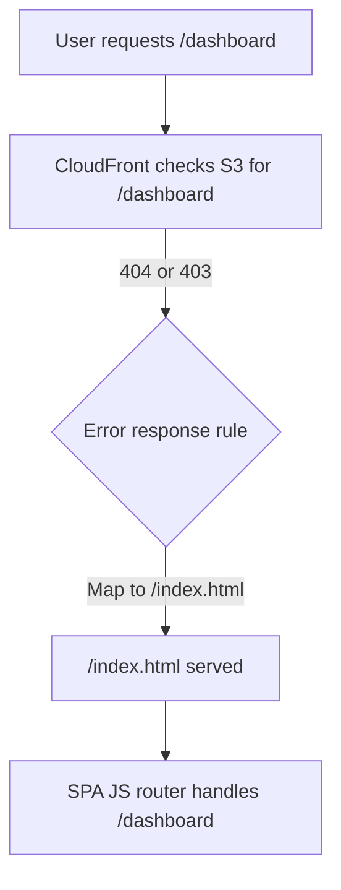

# ainews-hub
A dynamic Single Page Application (SPA) delivering the latest AI news and insights for my working company.

## SPA Routing with CloudFront and S3

- CloudFront is configured to map 404/403 errors to `/index.html`.
- This allows your SPA's router to handle deep links and browser refreshes for any route.
